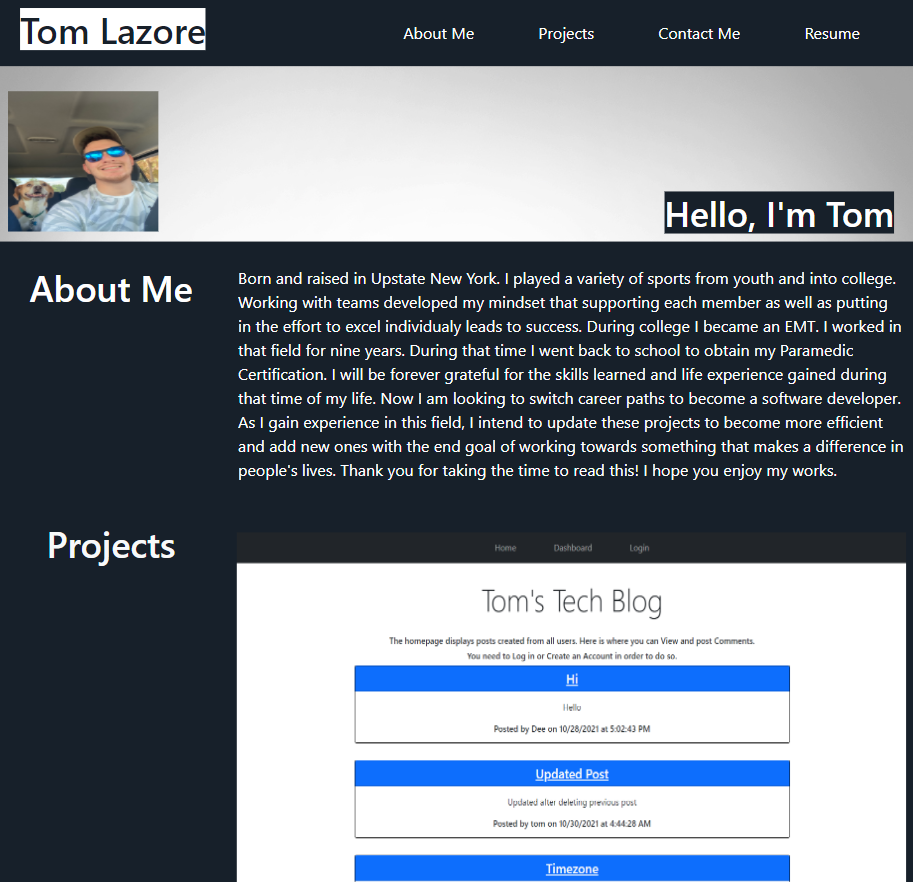

  
  
  # Lazore-Portfolio
  

  ## Table Of Contents

  * [Description](#description)

  * [Installation](#installation)

  * [Usage](#usage)

  * [License](#license)

  * [Contributors](#contributors)

  * [Tests](#tests)

  * [ScreenShots](#screenshots)

  * [Links](#links)

  * [Questions](#questions)

  ## Description

  Displays a bio about me, recent works completed, a resume, and links to contact me
  

  ## License
  
  This Project is licensed by [MIT](https://choosealicense.com/licenses/mit/).
  

  ## ScreenShot

  

  ## Links

  [Live Application](https://tlaze.github.io/Lazore-Portfolio/)

  [Project Repository](https://github.com/tlaze/Lazore-Portfolio)
  
  
  ## Questions

  If you have any questions, comments, or issues feel free to contact Tom Lazore directly through
  
  Email: tomlazore@gmail.com

  or check out my [GitHub](https://github.com/tlaze)

  
